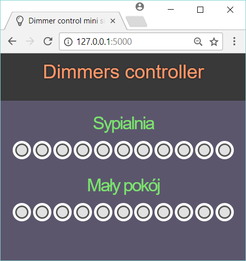

# Light dimmer for Raspberry Pi

The project made as part of my custom home automation solution.
This is Python 3 project tested on Python 3.5 and 3.6. 
Since it's quite simple it may work on older versions, but I won't recommend trying that.

This project uses:
* [RPi.GPIO](https://pypi.python.org/pypi/RPi.GPIO) library. Especially its software PWM part RPi.GPIO.PWM.
* [ZeroMQ](https://github.com/zeromq/pyzmq) to handle communication between client > server.
* [Flask](https://github.com/pallets/flask) for a mini web site based GUI interface.
* [Spark](https://github.com/twistedpixel/spark.git) for the GUI front-end.

Project includes:
* [dimmer_daemon.py](dimmer_control/dimmer_daemon.py) and [dimmer_control.service](dimmer_control/dimmer_control.service) to create a systemd service controlling the PWM channels.
* [dimmer_client.py](dimmer_control/dimmer_client.py) which provides a command line tool to communicate with dimmer_control service. This is also a place where you can import from a function used to communicate with dimmer_control service.
* [dimmer_site.py](dimmer_control/dimmer_site.py) and [dimmer_site.service](dimmer_control/dimmer_site.service) to create a systemd service based on Flask test server which provides a simple, mobile friendly GUI based on [spark project](https://github.com/twistedpixel/spark.git).
* [logger_configuration.py](dimmer_control/logger_configuration.py) where all mine custom logger methods are stored. 
* [configuration.py](dimmer_control/configuration.py) where you can modify some settings according to your implementation.

For simple implementation you probably only need to modify the configuration.py file and one of the .service files. 

### Quick-start installation
1. Copy whole [dimmer_control](dimmer_control) directory to /root/ on your Raspberry Pi.
2. Modify the ExecStart parameter in [dimmer_site.service](dimmer_control/dimmer_site.service) to match your RPi IP address. 
  ```
  ExecStart=+/usr/bin/flask run --host 192.168.0.52 --port 80
  ```
3. Copy both .service files to /etc/systemd/system/
  ```shell
  cp /root/dimmer_control/dimmer_control.service /etc/systemd/system/
  cp /root/dimmer_control/dimmer_site.service /etc/systemd/system/
  ```
4. Enable both services
  ```shell
  systemctl enable dimmer_control.service
  systemctl enable dimmer_site.service
  ```
5. They should start on system boot from now on. Now you can start them manually.
  ```shell
  systemctl start dimmer_control.service
  systemctl start dimmer_site.service
  ```

### Usage
#### Command line
The client script uses IPC protocol to communicate with the dimmer_control service. You may use it locally on your RPi (I use SSH client).
Tu run this tool go to dimmer_control directory and run it with python 3:
```shell
cd /root/dimmer_control
python3 ./dimmer_client.py
```
Client will ask you to enter light levels according to rooms defined in configuration.py and then send those values to dimmer_control service.

#### Web Service
Run your Web browser and enter your RPi IP address. You should see a simple GUI created according to your configuration.py. Backend uses a function from dimmer_client.py to communicate with dimmer_control service.


